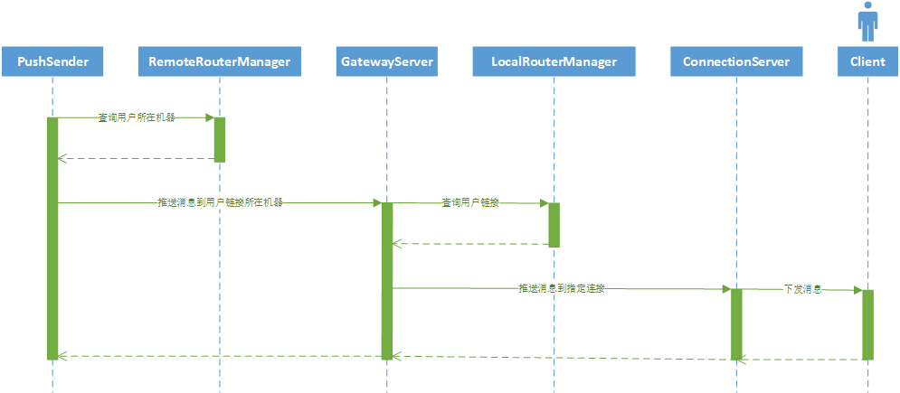

# MPush消息推送流程




RemoteRouterManager在Redis里面存储了userid对应的机器路由。 机器路由里主要是存放机器的ip和端口.

RemoteRouterManager是定义在mpush-common.jar里，被mpush-client引用，在App-server里被调用
存储结构是redis里的hash， 

key: 特定前缀+userId

field: clientType


LocalRouterManager定义在mpush-core里，运行在服务器端.

```java
    /**
     * 本地路由表
     */
    private final Map<String, Map<Integer, LocalRouter>> routers = new ConcurrentHashMap<>();

key : userId

value :  Map<Integer, LocalRouter>,    Integer 为clientType, LocalRouter包含实际的Connection（包含Channel对象）
```

